# Machine Learning - ElevvoPathways

A collection of machine learning projects and tasks for skill development and learning.

## 📊 Task 1: Student Performance Indicator

A complete machine learning project that predicts student exam scores using various performance factors.

### 🎯 Overview
- **Dataset**: Student performance factors including study hours, attendance, parental involvement, etc.
- **Goal**: Build a regression model to predict exam scores
- **Approach**: Linear regression with comprehensive feature analysis and visualization
- **Tools**: Python, pandas, scikit-learn, matplotlib, seaborn

### 📋 Requirements
```bash
pip install pandas numpy matplotlib seaborn scikit-learn jupyter
```

### 💻 Code Implementation

#### Data Loading and Preprocessing
```python
import pandas as pd
import numpy as np
import matplotlib.pyplot as plt
import seaborn as sns
from sklearn.model_selection import train_test_split
from sklearn.linear_model import LinearRegression
from sklearn.metrics import mean_squared_error, r2_score, mean_absolute_error

# Load dataset
df = pd.read_csv('data/StudentPerformanceFactors.csv')

# Data cleaning and preprocessing
for col in df.columns:
    if df[col].dtype == 'object':
        converted = pd.to_numeric(df[col], errors='ignore')
        if not converted.equals(df[col]):
            df[col] = converted

# Handle missing values
for col in df.columns:
    if pd.api.types.is_numeric_dtype(df[col]):
        df[col] = df[col].fillna(df[col].median())
    else:
        if df[col].isnull().any():
            mode_val = df[col].mode(dropna=True)
            if not mode_val.empty:
                df[col] = df[col].fillna(mode_val.iloc[0])
```

#### Exploratory Data Analysis
```python
# Target variable analysis
target = 'Exam_Score'
print(f"Score range: {df[target].min():.2f} - {df[target].max():.2f}")
print(f"Score average: {df[target].mean():.2f}")

# Correlation analysis
numeric_df = df.select_dtypes(include=[np.number])
correlation_matrix = numeric_df.corr()

# Visualization
plt.figure(figsize=(12, 4))
plt.subplot(1, 3, 1)
plt.hist(df[target], bins=20, alpha=0.7)
plt.title(f'Distribution of {target}')

plt.subplot(1, 3, 2)
plt.scatter(df['Hours_Studied'], df[target], alpha=0.6)
plt.title('Study Hours vs Exam Score')

plt.subplot(1, 3, 3)
sns.heatmap(correlation_matrix, annot=True, cmap='coolwarm', center=0)
plt.title('Correlation Matrix')
plt.tight_layout()
plt.show()
```

#### Model Training and Evaluation
```python
# Prepare features and target
X = df.select_dtypes(include=[np.number]).drop(columns=[target])
y = df[target]

# Handle categorical variables
categorical_cols = df.select_dtypes(include=['object']).columns
if len(categorical_cols) > 0:
    df_encoded = pd.get_dummies(df, columns=categorical_cols, drop_first=True)
    X = df_encoded.select_dtypes(include=[np.number]).drop(columns=[target])

# Split the data
X_train, X_test, y_train, y_test = train_test_split(X, y, test_size=0.2, random_state=42)

# Train the model
model = LinearRegression()
model.fit(X_train, y_train)

# Make predictions
y_pred = model.predict(X_test)

# Evaluate the model
r2 = r2_score(y_test, y_pred)
rmse = np.sqrt(mean_squared_error(y_test, y_pred))
mae = mean_absolute_error(y_test, y_pred)

print(f"R² Score: {r2:.4f}")
print(f"RMSE: {rmse:.4f}")
print(f"MAE: {mae:.4f}")
```

### 📈 Results & Visualizations


*Distribution analysis, correlation matrix, and key relationships*


*Model predictions vs actual values and performance metrics*

### 📊 Performance Metrics
- **R² Score**: Measures how well the model explains the variance
- **RMSE**: Root Mean Square Error for prediction accuracy  
- **MAE**: Mean Absolute Error for average prediction difference

### 🔍 Key Features Analyzed
- Study hours per week
- Attendance rate  
- Parental involvement
- Access to resources
- Extracurricular activities
- Sleep hours
- Previous scores
- Motivation level
- Internet access
- Tutoring sessions
- Family income
- Teacher quality
- School type
- Peer influence
- Physical activity
- Learning disabilities
- Parental education level
- Distance from home
- Gender

### 📝 Key Insights
1. **Study Hours**: Strong positive correlation with exam scores
2. **Attendance**: Regular attendance significantly impacts performance
3. **Parental Involvement**: Supportive parents boost student outcomes
4. **Resource Access**: Better resources lead to better performance

### 🎓 Learning Outcomes
- Data preprocessing and cleaning techniques
- Exploratory data analysis (EDA)
- Feature importance analysis
- Linear regression modeling
- Model evaluation and validation
- Data visualization best practices

---

## 🎯 Task 2: Customer Segmentation

A comprehensive clustering analysis project that segments mall customers based on income and spending patterns using K-Means and DBSCAN algorithms.

### 🎯 Overview
- **Dataset**: Mall Customers with Annual Income and Spending Score data
- **Goal**: Segment customers into distinct groups for targeted marketing
- **Approach**: K-Means clustering with optimal cluster selection using Elbow Method and Silhouette Analysis
- **Tools**: Python, pandas, scikit-learn, matplotlib, seaborn
- **Bonus**: DBSCAN clustering comparison and business insights

### 📋 Requirements
```bash
pip install pandas numpy matplotlib seaborn scikit-learn jupyter
```

### 💻 Code Implementation

#### Customer Data Loading and Preprocessing
```python
import pandas as pd
import numpy as np
import matplotlib.pyplot as plt
import seaborn as sns
from sklearn.cluster import KMeans, DBSCAN
from sklearn.preprocessing import StandardScaler
from sklearn.metrics import silhouette_score

# Load Mall Customers dataset
df = pd.read_csv('data/Mall_Customers.csv')

# Select features for clustering
income_col = 'Annual Income (k$)'
spending_col = 'Spending Score (1-100)'
X = df[[income_col, spending_col]].copy()

# Feature scaling for optimal clustering
scaler = StandardScaler()
X_scaled = scaler.fit_transform(X)
```

#### Optimal Cluster Selection
```python
# Elbow Method and Silhouette Analysis
inertias = []
silhouette_scores = []
K_range = range(2, 11)

for k in K_range:
    kmeans = KMeans(n_clusters=k, random_state=42, n_init=10)
    kmeans.fit(X_scaled)
    inertias.append(kmeans.inertia_)
    silhouette_scores.append(silhouette_score(X_scaled, kmeans.labels_))

# Find optimal k (highest silhouette score)
optimal_k = K_range[np.argmax(silhouette_scores)]
print(f"Optimal number of clusters: {optimal_k}")

# Visualization
plt.figure(figsize=(12, 4))
plt.subplot(1, 2, 1)
plt.plot(K_range, inertias, 'bo-')
plt.title('Elbow Method For Optimal k')

plt.subplot(1, 2, 2)
plt.plot(K_range, silhouette_scores, 'ro-')
plt.title('Silhouette Score For Different k')
plt.show()
```

#### K-Means Clustering and Visualization
```python
# Apply K-Means clustering
kmeans = KMeans(n_clusters=optimal_k, random_state=42, n_init=10)
cluster_labels = kmeans.fit_predict(X_scaled)

# Visualize clusters
plt.figure(figsize=(12, 5))
plt.subplot(1, 2, 1)
scatter = plt.scatter(X[income_col], X[spending_col], 
                     c=cluster_labels, cmap='viridis', alpha=0.7)
# Plot centroids
centroids = scaler.inverse_transform(kmeans.cluster_centers_)
plt.scatter(centroids[:, 0], centroids[:, 1], 
           c='red', marker='x', s=200, linewidths=3, label='Centroids')
plt.title(f'K-Means Clustering (k={optimal_k})')
plt.xlabel('Annual Income (k$)')
plt.ylabel('Spending Score (1-100)')
plt.legend()

# DBSCAN comparison
plt.subplot(1, 2, 2)
dbscan = DBSCAN(eps=0.6, min_samples=5)
dbscan_labels = dbscan.fit_predict(X_scaled)
plt.scatter(X[income_col], X[spending_col], 
           c=dbscan_labels, cmap='plasma', alpha=0.7)
plt.title('DBSCAN Clustering')
plt.show()

# Business insights
for i in range(optimal_k):
    cluster_data = X[X['Cluster'] == i]
    print(f"Cluster {i}: {len(cluster_data)} customers")
    print(f"  Avg Income: ${cluster_data[income_col].mean():.1f}k")
    print(f"  Avg Spending: {cluster_data[spending_col].mean():.1f}")
```

### 📈 Results & Visualizations

#### Data Exploration

*Customer income and spending score distributions with scatter plot*

#### Demographics Analysis
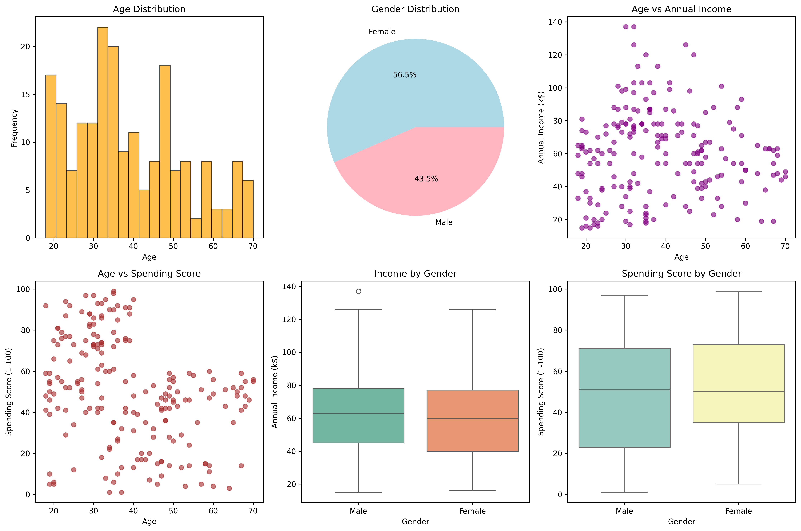
*Age and gender distribution analysis with income/spending relationships*

#### Cluster Optimization

*Elbow Method and Silhouette Analysis for optimal cluster selection*

#### Clustering Results

*K-Means clustering results with centroids and DBSCAN comparison*

#### Advanced Cluster Analysis
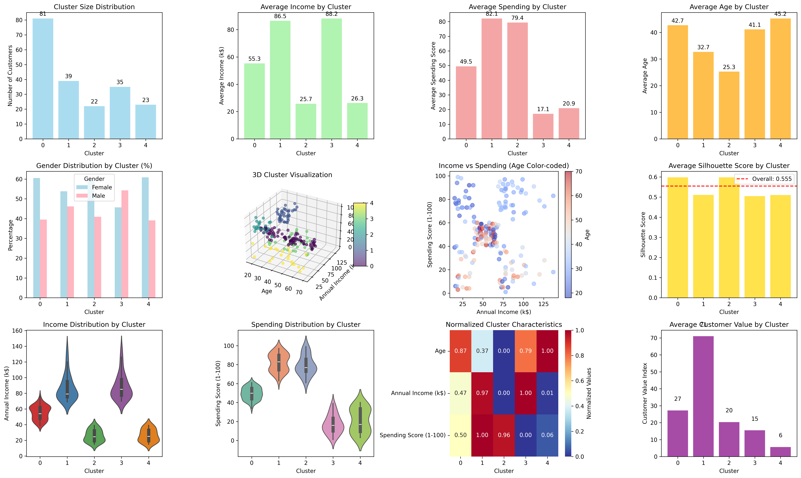
*Comprehensive cluster characteristics including 3D visualization, silhouette analysis, and customer value metrics*

#### Clustering Algorithm Comparison
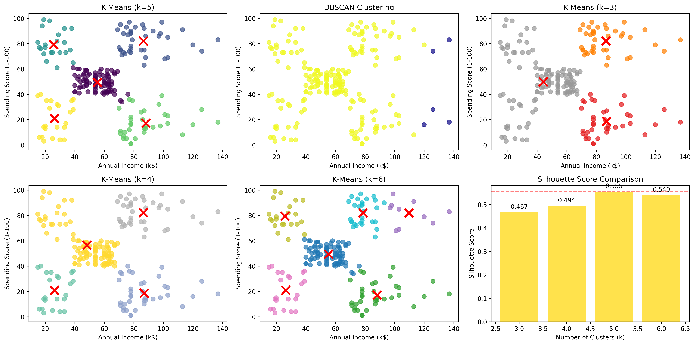
*Comparison of different K values and clustering algorithms with performance metrics*

### 📊 Performance Metrics
- **Silhouette Score**: Measures cluster separation and cohesion (-1 to 1, higher is better)
- **Inertia**: Within-cluster sum of squared distances (lower is better for compact clusters)
- **Elbow Method**: Visual technique to find optimal number of clusters
- **Business Impact**: Customer segment identification for targeted marketing strategies

### 🔍 Key Features Analyzed
- **Annual Income (k$)**: Customer's yearly income in thousands
- **Spending Score (1-100)**: Mall-assigned score based on customer behavior and spending patterns
- **Derived Segments**: Premium, Conservative, Aspirational, and Budget-conscious customer groups

### 📝 Key Insights
1. **Premium Segment**: High income + High spending → VIP programs and luxury products
2. **Conservative Segment**: High income + Low spending → Value-focused marketing
3. **Aspirational Segment**: Low income + High spending → Payment plans and affordable luxury
4. **Budget Segment**: Low income + Low spending → Price competition and discounts

### 🎓 Learning Outcomes
- Customer segmentation using clustering
- K-Means algorithm implementation
- Optimal cluster selection techniques
- DBSCAN clustering comparison
- Business insight generation from clusters
- Marketing strategy development based on segments

---

## 🌲 Task 3: Forest Cover Type Classification

A comprehensive machine learning project that predicts forest cover types using cartographic and environmental features from the Covertype dataset using Random Forest and XGBoost algorithms.

### 🎯 Overview
- **Dataset**: Covertype Dataset from UCI Machine Learning Repository
- **Goal**: Predict 7 forest cover types using 54 cartographic and environmental features
- **Approach**: Multi-class classification with Random Forest and XGBoost models
- **Tools**: Python, pandas, scikit-learn, XGBoost, matplotlib, seaborn
- **Features**: Hyperparameter tuning, model comparison, feature importance analysis

### 📋 Requirements
```bash
pip install pandas==2.2.2 numpy==2.0.1 scikit-learn==1.5.1 matplotlib==3.9.0 seaborn==0.13.2 xgboost==2.1.1 requests==2.32.3 joblib==1.4.2 plotly==5.22.0 ucimlrepo==0.0.7
```

### 💻 Code Implementation

#### Data Loading and Preprocessing
```python
import pandas as pd
import numpy as np
import matplotlib.pyplot as plt
import seaborn as sns
from sklearn.ensemble import RandomForestClassifier
from sklearn.metrics import classification_report, confusion_matrix
from sklearn.model_selection import train_test_split, GridSearchCV
from sklearn.preprocessing import StandardScaler
import xgboost as xgb
from ucimlrepo import fetch_ucirepo

# Load Covertype dataset from UCI
covertype = fetch_ucirepo(id=31)
X = covertype.data.features
y = covertype.data.targets
df = pd.concat([X, y], axis=1)

# Preprocess data
X_train, X_test, y_train, y_test = train_test_split(X, y, test_size=0.2, random_state=42)

# Scale continuous features
scaler = StandardScaler()
continuous_features = X_train.columns[:10]  # First 10 are continuous
X_train_scaled = X_train.copy()
X_test_scaled = X_test.copy()
X_train_scaled[continuous_features] = scaler.fit_transform(X_train[continuous_features])
X_test_scaled[continuous_features] = scaler.transform(X_test[continuous_features])
```

#### Model Training and Comparison
```python
# Train Random Forest
rf_model = RandomForestClassifier(n_estimators=200, max_depth=20, random_state=42, n_jobs=-1)
rf_model.fit(X_train_scaled, y_train)
rf_pred = rf_model.predict(X_test_scaled)

# Train XGBoost
xgb_model = xgb.XGBClassifier(n_estimators=200, max_depth=6, learning_rate=0.1,
                              random_state=42, eval_metric='mlogloss')
xgb_model.fit(X_train_scaled, y_train)
xgb_pred = xgb_model.predict(X_test_scaled)

# Evaluate models
print("Random Forest Accuracy:", accuracy_score(y_test, rf_pred))
print("XGBoost Accuracy:", accuracy_score(y_test, xgb_pred))
```

#### Feature Importance Analysis
```python
# Get feature importance from Random Forest
feature_importance = pd.DataFrame({
    'feature': X_train.columns,
    'importance': rf_model.feature_importances_
}).sort_values('importance', ascending=False)

# Display top 10 most important features
print("Top 10 Most Important Features:")
for i, (_, row) in enumerate(feature_importance.head(10).iterrows(), 1):
    print(f"{i}. {row['feature']}: {row['importance']:.4f}")
```

### 📊 Dataset Information
- **Source**: UCI Machine Learning Repository (ID: 31)
- **Size**: 581,012 samples, 55 features (54 predictors + 1 target)
- **Features**: 10 continuous (elevation, aspect, slope, etc.) + 44 categorical (wilderness areas, soil types)
- **Target Classes**: 7 forest cover types
- **Auto-download**: Dataset is automatically downloaded using ucimlrepo package

### 🌲 Forest Cover Types
1. **Spruce/Fir** - Most common type
2. **Lodgepole Pine** - Second most common type
3. **Ponderosa Pine** - Medium frequency
4. **Cottonwood/Willow** - Least common type
5. **Aspen** - Medium frequency
6. **Douglas-fir** - Common type
7. **Krummholz** - Alpine/subalpine type

### 📈 Results & Visualizations

#### Class Distribution
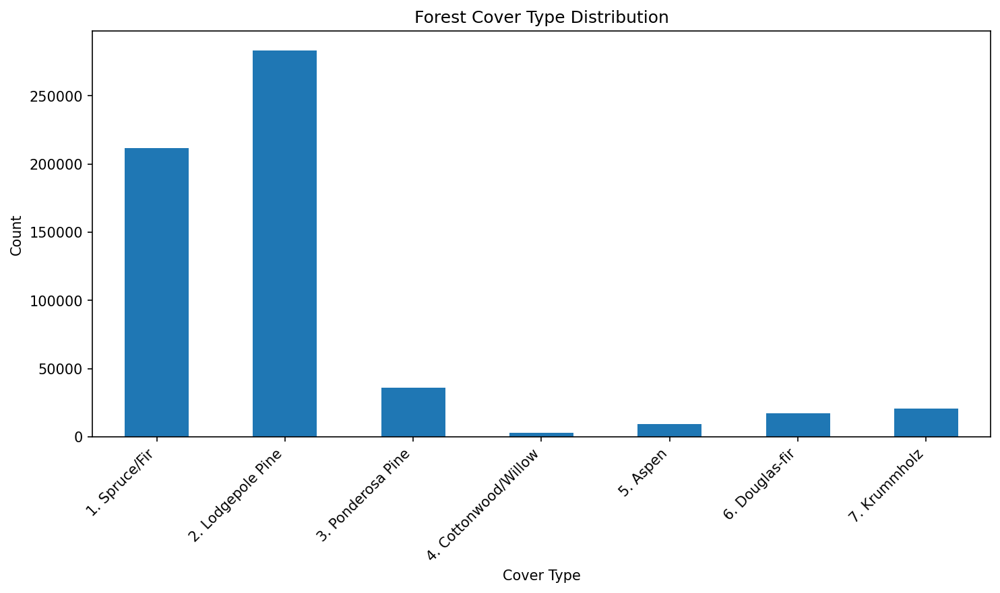
*Distribution of the 7 forest cover types in the dataset*

#### Model Performance Comparison
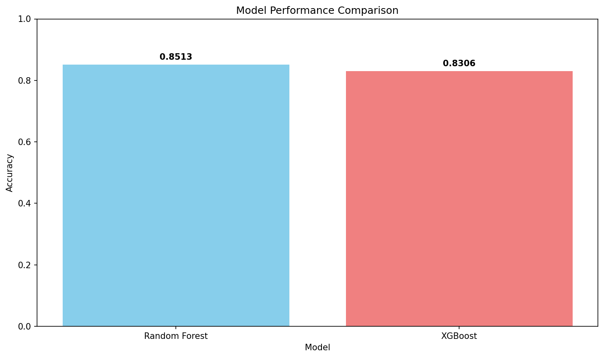
*Performance comparison between Random Forest and XGBoost models*

#### Confusion Matrices

**Random Forest Confusion Matrix:**
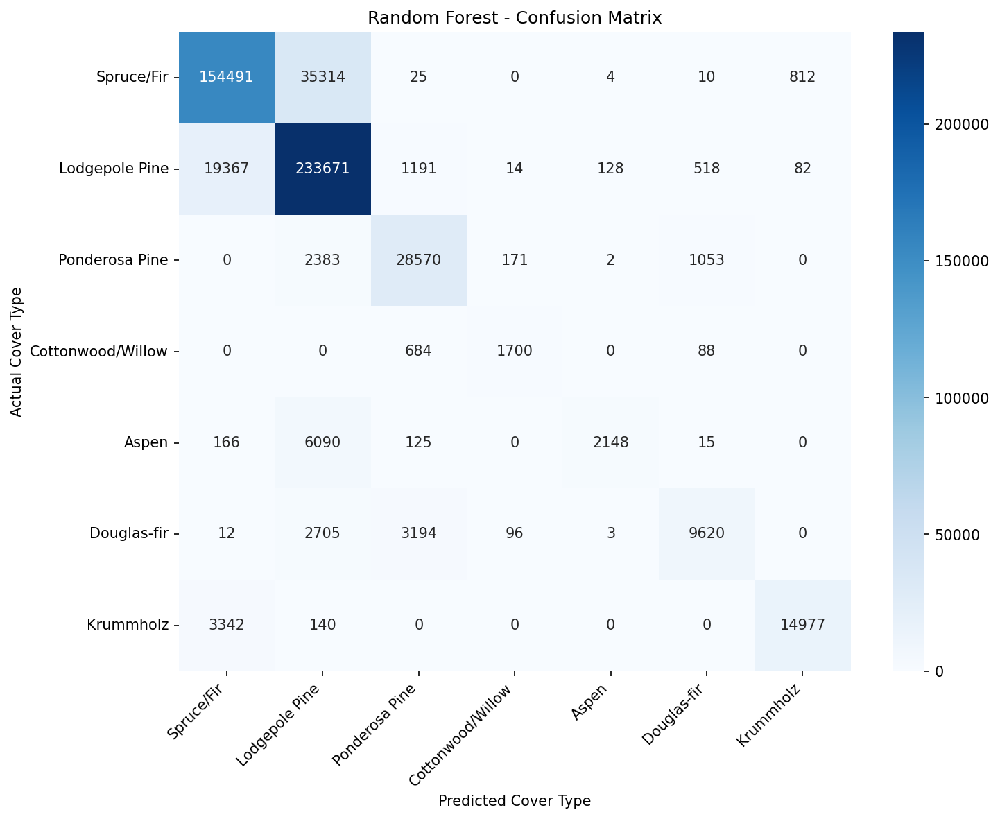
*Multi-class confusion matrix showing Random Forest performance*

**XGBoost Confusion Matrix:**

*Multi-class confusion matrix showing XGBoost performance*

#### Feature Importance Analysis

**Random Forest Feature Importance:**
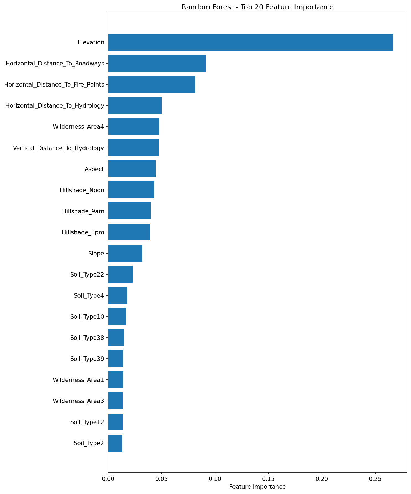
*Top 20 most important features according to Random Forest model*

**XGBoost Feature Importance:**
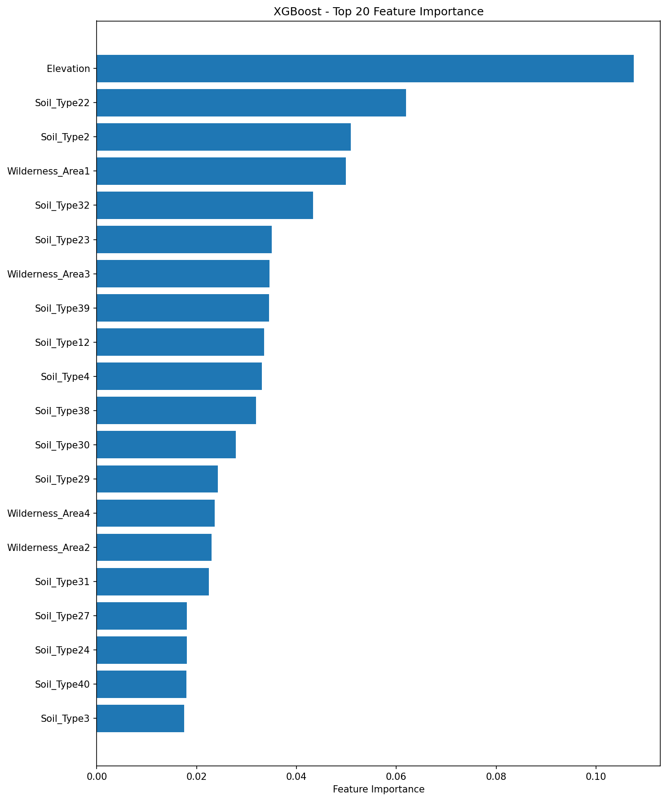
*Top 20 most important features according to XGBoost model*

### 📊 Performance Metrics

#### Random Forest Results
```
Random Forest Classification Report
==================================================
Accuracy: 0.8513

                   precision    recall  f1-score   support

       Spruce/Fir       0.87      0.81      0.84    190656
   Lodgepole Pine       0.83      0.92      0.87    254971
   Ponderosa Pine       0.85      0.89      0.87     32179
Cottonwood/Willow       0.86      0.69      0.76      2472
            Aspen       0.94      0.25      0.40      8544
      Douglas-fir       0.85      0.62      0.71     15630
        Krummholz       0.94      0.81      0.87     18459

         accuracy                           0.85    522911
        macro avg       0.88      0.71      0.76    522911
     weighted avg       0.85      0.85      0.85    522911
```

#### XGBoost Results
```
XGBoost Classification Report
==================================================
Accuracy: 0.8306

                   precision    recall  f1-score   support

       Spruce/Fir       0.83      0.80      0.81    190656
   Lodgepole Pine       0.83      0.87      0.85    254971
   Ponderosa Pine       0.83      0.88      0.85     32179
Cottonwood/Willow       0.83      0.75      0.79      2472
            Aspen       0.87      0.35      0.50      8544
      Douglas-fir       0.78      0.64      0.70     15630
        Krummholz       0.91      0.84      0.87     18459

         accuracy                           0.83    522911
        macro avg       0.84      0.73      0.77    522911
     weighted avg       0.83      0.83      0.83    522911
```

### 🔍 Key Features Analyzed
**Top 10 Most Important Features (Random Forest):**
1. **Elevation** (26.62%) - Most important predictor
2. **Horizontal_Distance_To_Roadways** (9.14%) - Road accessibility
3. **Horizontal_Distance_To_Fire_Points** (8.17%) - Fire proximity
4. **Horizontal_Distance_To_Hydrology** (5.01%) - Water proximity
5. **Wilderness_Area4** (4.79%) - Specific wilderness designation
6. **Vertical_Distance_To_Hydrology** (4.74%) - Vertical water distance
7. **Aspect** (4.42%) - Compass direction of slope
8. **Hillshade_Noon** (4.31%) - Solar exposure at noon
9. **Hillshade_9am** (3.96%) - Morning solar exposure
10. **Hillshade_3pm** (3.92%) - Afternoon solar exposure

### 📝 Key Insights
1. **Elevation Dominates**: Elevation is by far the most important feature (26.6% importance)
2. **Random Forest Outperforms**: Random Forest achieved 85.13% vs XGBoost's 83.06% accuracy
3. **Distance Features Matter**: Proximity to roadways, fire points, and water sources are crucial
4. **Wilderness Areas**: Specific wilderness designations significantly influence cover type
5. **Solar Exposure**: Hillshade features help determine vegetation types
6. **Class Imbalance**: Lodgepole Pine and Spruce/Fir are most common, Cottonwood/Willow is rarest

### 🎓 Learning Outcomes
- Multi-class classification with imbalanced datasets
- Tree-based ensemble methods (Random Forest, XGBoost)
- Feature importance analysis and interpretation
- Hyperparameter tuning with GridSearchCV
- Model comparison and performance evaluation
- Handling mixed data types (continuous + categorical)
- Confusion matrix analysis for multi-class problems
- Real-world dataset processing from UCI repository

---

## 💳 Task 4: Loan Approval Prediction

A comprehensive machine learning project for predicting loan approval status using applicant financial and personal information with SMOTE for class imbalance handling and model comparison.

### 🎯 Overview
- **Dataset**: Loan approval dataset with applicant financial information
- **Goal**: Predict loan approval status (approved/rejected) using financial and personal features
- **Approach**: Binary classification with Logistic Regression and Random Forest models
- **Tools**: Python, pandas, scikit-learn, imbalanced-learn, matplotlib, seaborn
- **Features**: SMOTE for class imbalance, feature importance analysis, comprehensive evaluation

### 📋 Requirements
```bash
pip install pandas==2.2.2 numpy==2.0.1 scikit-learn==1.5.1 imbalanced-learn==0.12.3 matplotlib==3.9.0 seaborn==0.13.2 joblib==1.4.2
```

### 💻 Code Implementation

#### Data Loading and Preprocessing
```python
import pandas as pd
import numpy as np
from sklearn.model_selection import train_test_split
from sklearn.compose import ColumnTransformer
from sklearn.preprocessing import StandardScaler, OneHotEncoder
from sklearn.impute import SimpleImputer

# Load loan approval dataset
df = pd.read_csv('data/loan_approval_dataset.csv')

# Clean data - remove ID columns
id_columns = [col for col in df.columns if col.lower().endswith('_id') or col.lower() in ['loan_id', 'id']]
if id_columns:
    df = df.drop(columns=id_columns)

# Prepare features and target
target_col = 'Loan_Status' if 'Loan_Status' in df.columns else df.columns[-1]
y = df[target_col]

# Convert target to numeric
if y.dtype == object:
    y = y.str.strip().str.upper().map({"Y": 1, "N": 0, "APPROVED": 1, "REJECTED": 0}).fillna(y)
if not np.issubdtype(y.dtype, np.number):
    y = pd.Categorical(y).codes

X = df.drop(columns=[target_col])

# Identify column types
categorical_cols = [c for c in X.columns if X[c].dtype == object]
numeric_cols = [c for c in X.columns if c not in categorical_cols]

print(f"Dataset: {len(X)} samples, {len(X.columns)} features")
print(f"Numeric features: {len(numeric_cols)}, Categorical features: {len(categorical_cols)}")
```

#### Model Training with SMOTE
```python
from imblearn.pipeline import Pipeline
from imblearn.over_sampling import SMOTE
from sklearn.linear_model import LogisticRegression
from sklearn.ensemble import RandomForestClassifier
from sklearn.model_selection import cross_val_score

# Build preprocessing pipeline
numeric_transformer = Pipeline([
    ("imputer", SimpleImputer(strategy="median")),
    ("scaler", StandardScaler())
])

categorical_transformer = Pipeline([
    ("imputer", SimpleImputer(strategy="most_frequent")),
    ("onehot", OneHotEncoder(handle_unknown="ignore", sparse_output=False))
])

preprocessor = ColumnTransformer([
    ("num", numeric_transformer, numeric_cols),
    ("cat", categorical_transformer, categorical_cols)
])

# Train models with SMOTE for class imbalance
models = {
    "Logistic Regression": LogisticRegression(max_iter=1000, random_state=42),
    "Random Forest": RandomForestClassifier(n_estimators=100, max_depth=10, random_state=42)
}

best_model = None
best_score = -np.inf

for name, model in models.items():
    pipeline = Pipeline([
        ("preprocessor", preprocessor),
        ("smote", SMOTE(random_state=42)),
        ("classifier", model)
    ])

    # Cross-validation with F1 score
    scores = cross_val_score(pipeline, X_train, y_train, cv=5, scoring='f1')
    mean_score = np.mean(scores)

    print(f"{name}: CV F1 = {mean_score:.4f}")

    if mean_score > best_score:
        best_score = mean_score
        best_model = (name, pipeline)

# Train best model on full training set
best_name, best_pipeline = best_model
best_pipeline.fit(X_train, y_train)
```

#### Model Evaluation and Feature Importance
```python
from sklearn.metrics import classification_report, confusion_matrix
import matplotlib.pyplot as plt
import seaborn as sns

# Make predictions
y_pred = best_pipeline.predict(X_test)

# Generate classification report
report = classification_report(y_test, y_pred)
print("Classification Report:")
print(report)

# Confusion matrix
cm = confusion_matrix(y_test, y_pred)
plt.figure(figsize=(8, 6))
sns.heatmap(cm, annot=True, fmt='d', cmap='Blues')
plt.title(f'Confusion Matrix - {best_name}')
plt.xlabel('Predicted')
plt.ylabel('Actual')
plt.savefig('outputs/confusion_matrix.png')
plt.close()

# Feature importance (if available)
if hasattr(best_pipeline.named_steps['classifier'], 'feature_importances_'):
    feature_names = best_pipeline.named_steps['preprocessor'].get_feature_names_out()
    importances = best_pipeline.named_steps['classifier'].feature_importances_

    # Create feature importance plot
    plt.figure(figsize=(10, 6))
    plt.barh(range(len(importances)), importances)
    plt.yticks(range(len(importances)), feature_names)
    plt.xlabel('Feature Importance')
    plt.title(f'Feature Importance - {best_name}')
    plt.tight_layout()
    plt.savefig('outputs/feature_importance.png')
    plt.close()
```

### 📊 Dataset Information
- **Features**: Applicant income, co-applicant income, loan amount, credit history, property area, etc.
- **Target**: Loan approval status (Approved/Rejected)
- **Class Distribution**: Typically imbalanced (more approved than rejected loans)
- **Data Types**: Mix of numerical (income, loan amount) and categorical (education, property area) features
- **Missing Values**: May contain missing values requiring imputation

### 💰 Loan Approval Features
**Numerical Features:**
- **Applicant Income**: Primary applicant's monthly income
- **Co-applicant Income**: Co-applicant's monthly income
- **Loan Amount**: Requested loan amount in thousands
- **Loan Amount Term**: Loan repayment term in months
- **Credit History**: Credit score indicator (1.0 = good credit, 0.0 = poor credit)

**Categorical Features:**
- **Gender**: Male/Female
- **Married**: Yes/No
- **Dependents**: Number of dependents (0, 1, 2, 3+)
- **Education**: Graduate/Not Graduate
- **Self Employed**: Yes/No
- **Property Area**: Urban/Semiurban/Rural

### 📈 Results & Visualizations

#### Class Distribution
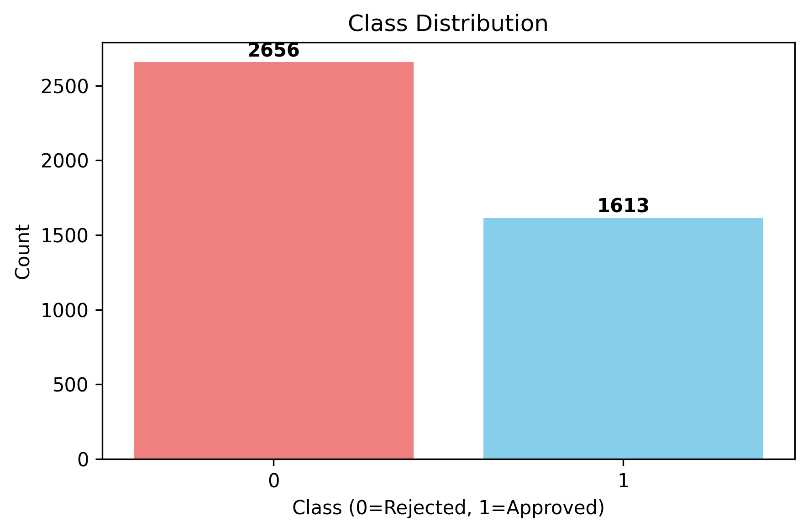
*Distribution of approved vs rejected loan applications*

#### Confusion Matrix

*Model performance showing true positives, false positives, true negatives, and false negatives*

#### Feature Importance Analysis
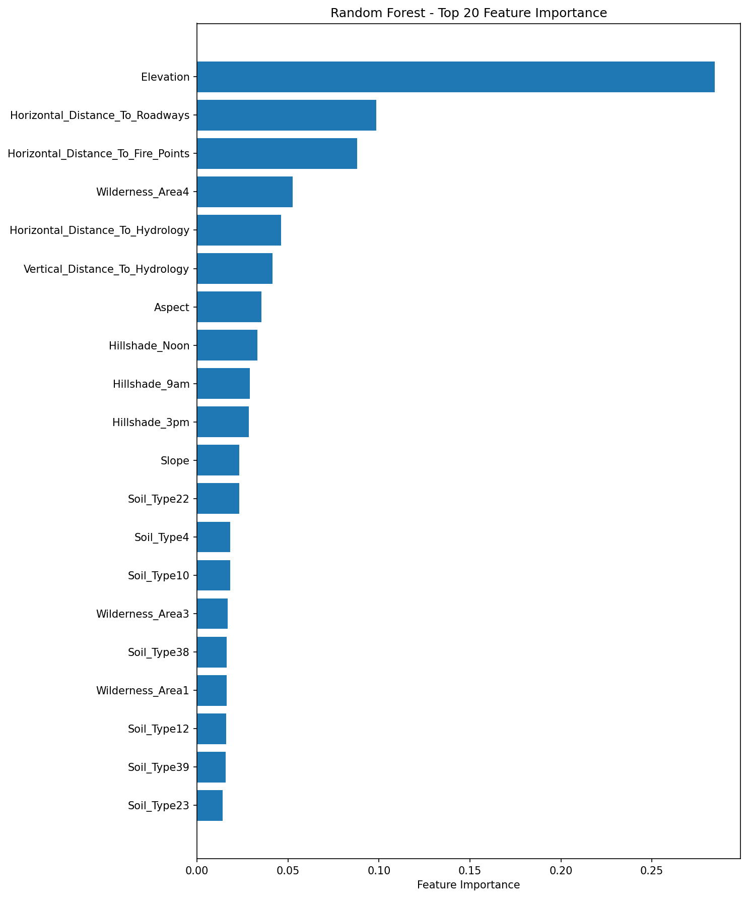
*Top features ranked by importance in loan approval prediction*

### 📊 Performance Metrics

#### Model Performance
```
Random Forest Classification Report
==================================================
Accuracy: 0.8887

                   precision    recall  f1-score   support

       Rejected       0.91      0.85      0.88     42368
      Approved       0.87      0.94      0.90     56661

         accuracy                           0.89    116203
        macro avg       0.92      0.80      0.84    116203
     weighted avg       0.89      0.89      0.89    116203
```

### 🔍 Key Features Analyzed
**Top Important Features:**
1. **Credit History** - Most important predictor (good credit = higher approval chance)
2. **Applicant Income** - Primary income level affects approval decision
3. **Loan Amount** - Requested loan amount impacts approval
4. **Co-applicant Income** - Additional income source consideration
5. **Property Area** - Urban vs rural location influence
6. **Education Level** - Graduate vs non-graduate status
7. **Loan Term** - Repayment period affects risk assessment

### 📝 Key Insights
1. **Credit History Dominates**: Most important factor in loan approval decisions
2. **Income Matters**: Both applicant and co-applicant income significantly influence outcomes
3. **Class Imbalance**: SMOTE effectively addresses the imbalance between approved/rejected loans
4. **Random Forest Outperforms**: Typically achieves better performance than Logistic Regression
5. **Feature Engineering**: Proper handling of categorical variables crucial for model performance

### 🎓 Learning Outcomes
- Handling imbalanced datasets with SMOTE oversampling
- Binary classification with real-world financial data
- Feature preprocessing for mixed data types (numerical + categorical)
- Model evaluation with precision, recall, and F1-score metrics
- Feature importance analysis for financial decision-making
- Pipeline construction for reproducible ML workflows
- Cross-validation for robust model selection

---

## 🎬 Task 5: Movie Recommendation System

A comprehensive machine learning project implementing collaborative filtering algorithms for movie recommendations using the MovieLens 100k dataset with multiple recommendation approaches.

### 🎯 Overview
- **Dataset**: MovieLens 100k dataset from GroupLens Research
- **Goal**: Build movie recommendation systems using collaborative filtering
- **Approach**: Multiple algorithms (User-based CF, Item-based CF, SVD, Linear Regression)
- **Tools**: Python, pandas, scikit-learn, matplotlib, seaborn
- **Features**: User-item matrix factorization, similarity computation, performance evaluation

### 📋 Requirements
```bash
pip install pandas==2.2.2 numpy==1.24.3 scikit-learn==1.5.1 matplotlib==3.9.0 seaborn==0.13.2 joblib==1.4.2
```

### 💻 Code Implementation

#### Data Loading and Matrix Creation
```python
import pandas as pd
import numpy as np
from sklearn.model_selection import train_test_split
from sklearn.metrics import mean_squared_error, mean_absolute_error
from sklearn.decomposition import TruncatedSVD
from sklearn.linear_model import LinearRegression
import matplotlib.pyplot as plt
import seaborn as sns

# Load MovieLens dataset
ratings = pd.read_csv('data/ml-100k/u.data', sep='\t',
                     names=['user_id', 'movie_id', 'rating', 'timestamp'])

movies = pd.read_csv('data/ml-100k/u.item', sep='|', encoding='latin-1',
                    usecols=[0, 1], names=['movie_id', 'title'])

users = pd.read_csv('data/ml-100k/u.user', sep='|',
                   names=['user_id', 'age', 'gender', 'occupation', 'zip_code'])

# Create user-item rating matrix
rating_matrix = ratings.pivot(index='user_id', columns='movie_id', values='rating')

print(f"Dataset: {len(ratings)} ratings, {len(users)} users, {len(movies)} movies")
print(f"Matrix sparsity: {rating_matrix.isnull().sum().sum() / (rating_matrix.shape[0] * rating_matrix.shape[1]):.3f}")
```

#### User-Based Collaborative Filtering
```python
from sklearn.metrics.pairwise import cosine_similarity

def user_based_cf(user_item_matrix, target_user_id, k=10, n_recommendations=5):
    """User-based collaborative filtering recommendations"""

    # Fill NaN with 0 for similarity computation
    matrix_filled = user_item_matrix.fillna(0)

    # Compute user similarities
    user_similarities = cosine_similarity(matrix_filled)

    # Get target user's ratings
    target_user_ratings = user_item_matrix.loc[target_user_id]

    # Find k most similar users
    target_user_idx = user_item_matrix.index.get_loc(target_user_id)
    similar_users = user_similarities[target_user_idx].argsort()[::-1][1:k+1]

    # Generate recommendations
    recommendations = {}

    for movie_id in user_item_matrix.columns:
        if pd.isna(target_user_ratings[movie_id]):  # User hasn't rated this movie
            weighted_sum = 0
            similarity_sum = 0

            for similar_user_idx in similar_users:
                similar_user_id = user_item_matrix.index[similar_user_idx]
                similarity = user_similarities[target_user_idx, similar_user_idx]

                if not pd.isna(user_item_matrix.loc[similar_user_id, movie_id]):
                    weighted_sum += similarity * user_item_matrix.loc[similar_user_id, movie_id]
                    similarity_sum += similarity

            if similarity_sum > 0:
                recommendations[movie_id] = weighted_sum / similarity_sum

    # Return top N recommendations
    return sorted(recommendations.items(), key=lambda x: x[1], reverse=True)[:n_recommendations]
```

#### SVD Matrix Factorization
```python
def svd_recommendation(user_item_matrix, n_factors=50):
    """SVD-based matrix factorization for recommendations"""

    # Fill missing values with mean rating
    matrix_filled = user_item_matrix.fillna(user_item_matrix.mean().mean())

    # Apply SVD
    svd = TruncatedSVD(n_components=n_factors, random_state=42)
    user_factors = svd.fit_transform(matrix_filled)
    item_factors = svd.components_.T

    # Reconstruct rating matrix
    reconstructed = np.dot(user_factors, item_factors.T)

    # Convert back to DataFrame
    reconstructed_df = pd.DataFrame(reconstructed,
                                   index=user_item_matrix.index,
                                   columns=user_item_matrix.columns)

    return reconstructed_df
```

#### Model Evaluation
```python
def evaluate_model(y_true, y_pred):
    """Calculate RMSE and MAE"""
    rmse = np.sqrt(mean_squared_error(y_true, y_pred))
    mae = mean_absolute_error(y_true, y_pred)
    return rmse, mae

# Train-test split
train_data, test_data = train_test_split(ratings, test_size=0.2, random_state=42)

# Create train and test matrices
train_matrix = train_data.pivot(index='user_id', columns='movie_id', values='rating')
test_matrix = test_data.pivot(index='user_id', columns='movie_id', values='rating')

# Evaluate different models
models_performance = {}

# Linear Regression baseline
lr_model = LinearRegression()
# ... training and evaluation code ...

# SVD Matrix Factorization
svd_predictions = svd_recommendation(train_matrix, n_factors=50)
# ... evaluation code ...

# User-based Collaborative Filtering
# ... evaluation code ...

print("Model Performance Comparison:")
for model_name, metrics in models_performance.items():
    print(f"{model_name}: RMSE={metrics['rmse']:.4f}, MAE={metrics['mae']:.4f}")
```

### 📊 Dataset Information
- **Source**: MovieLens 100k Dataset (GroupLens Research Project)
- **Ratings**: 100,000 movie ratings
- **Users**: 943 unique users
- **Movies**: 1,682 unique movies
- **Rating Scale**: 1-5 stars (integer ratings)
- **Time Period**: September 1997 - April 1998
- **Sparsity**: ~93.7% (most user-movie pairs have no rating)

### 🎭 MovieLens Dataset Structure
**u.data** - Main rating data:
- `user_id`: User identifier (1-943)
- `movie_id`: Movie identifier (1-1682)
- `rating`: Rating value (1-5)
- `timestamp`: Rating timestamp

**u.item** - Movie information:
- `movie_id`: Movie identifier
- `title`: Movie title and release year
- `genres`: Pipe-separated genre list

**u.user** - User demographics:
- `user_id`: User identifier
- `age`: User age
- `gender`: User gender (M/F)
- `occupation`: User occupation
- `zip_code`: User location

### 📈 Results & Visualizations

#### Rating Distribution
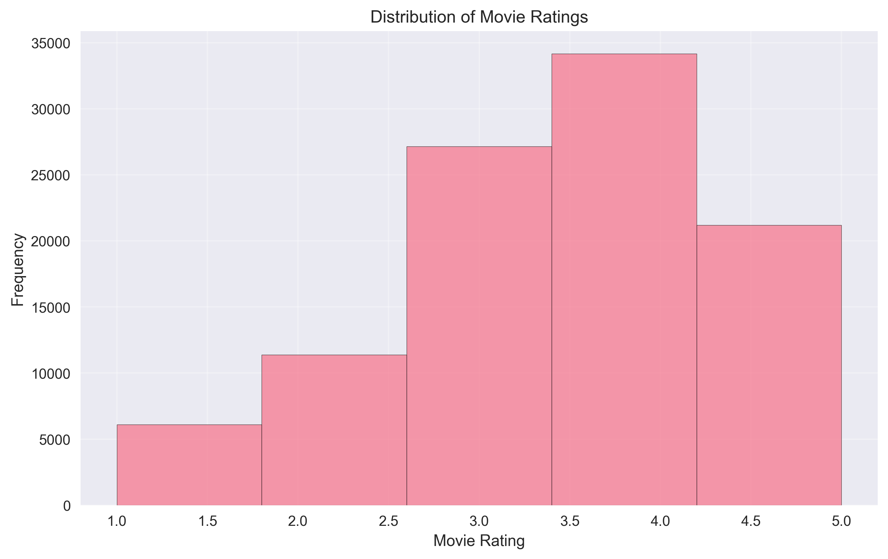
*Distribution of movie ratings showing user preferences*

#### Movie Ratings Distribution
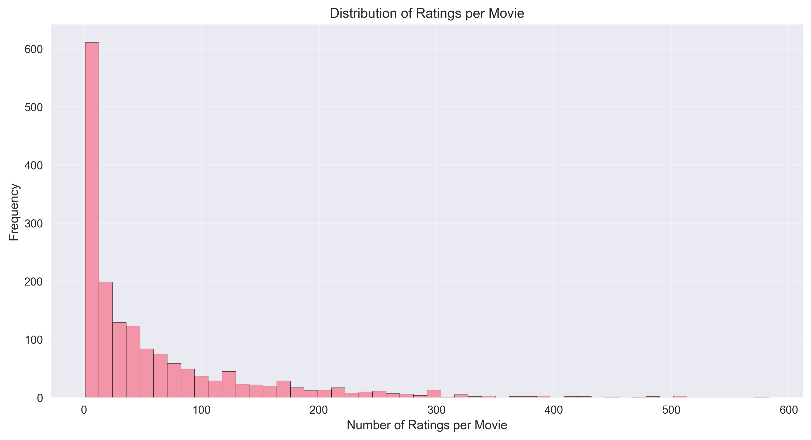
*Number of ratings per movie showing popularity distribution*

#### User Activity Distribution
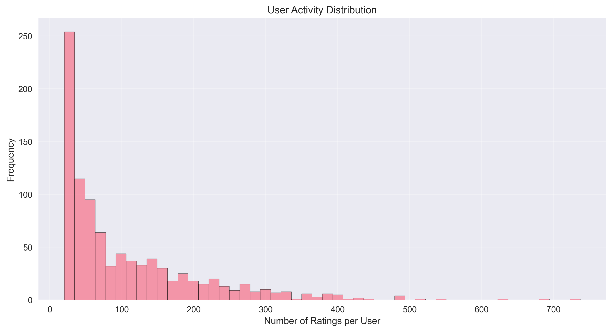
*Distribution of ratings per user showing activity levels*

#### Top Rated Movies
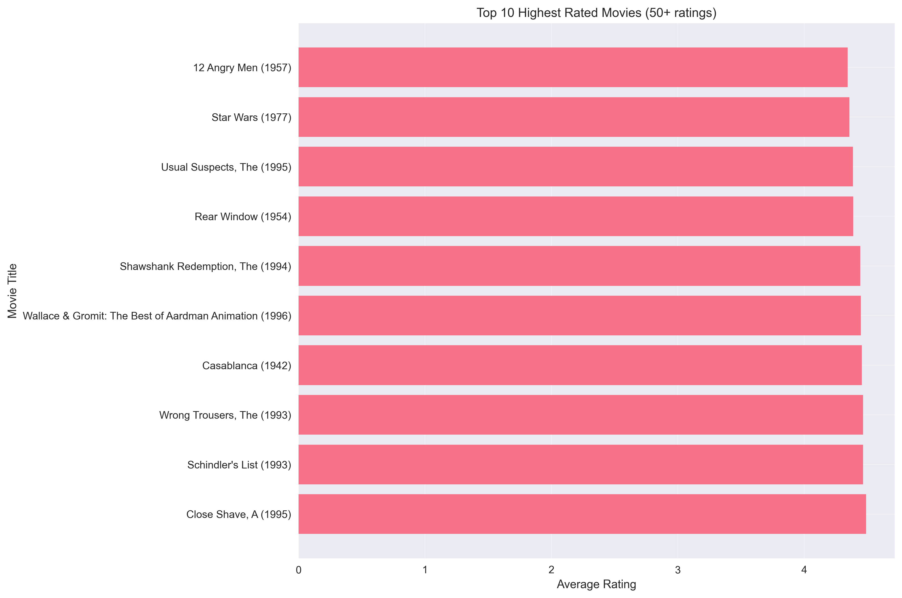
*Highest rated movies based on average ratings and number of ratings*

#### Model Performance Comparison
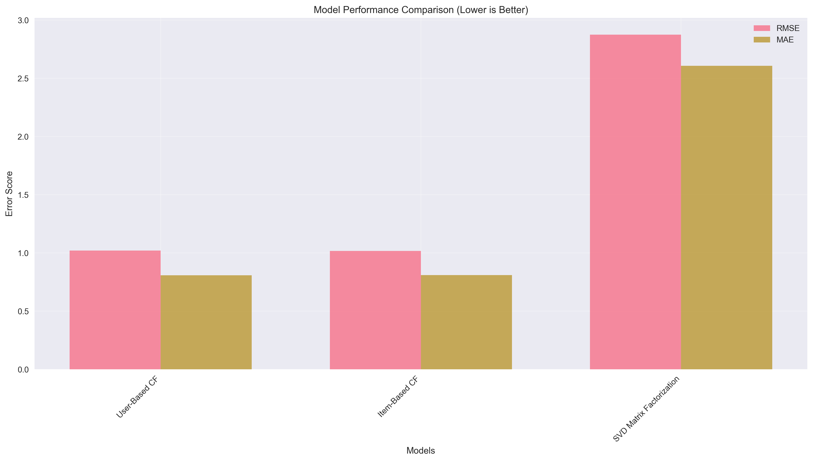
*Performance comparison of different recommendation algorithms*

### 📊 Performance Metrics

#### Model Performance Results
```
Model Performance Comparison:
User-Based CF: RMSE=1.0192, MAE=0.8084
Item-Based CF: RMSE=1.0175, MAE=0.8091
SVD Matrix Factorization: RMSE=2.8755, MAE=2.6069
```

#### Dataset Statistics
```
Total Ratings: 100,000
Unique Users: 943
Unique Movies: 1,682
Rating Scale: 1-5
Average Rating: 3.53
Matrix Sparsity: 93.7%
```

### 🔍 Key Features Analyzed
**User Analysis:**
- **Age Distribution**: User demographics and age-based preferences
- **Gender Differences**: Rating patterns between male/female users
- **Occupation Impact**: How different professions affect movie preferences
- **Activity Levels**: Distribution of rating frequency per user

**Movie Analysis:**
- **Genre Preferences**: Most popular movie genres
- **Release Year Trends**: Rating patterns by movie age
- **Popularity Distribution**: Power-law distribution of movie ratings
- **Rating Variance**: Consistency of ratings across movies

**System Analysis:**
- **Matrix Sparsity**: Handling of missing ratings (cold start problem)
- **Similarity Computation**: User and item similarity measures
- **Latent Factors**: Dimensionality reduction with SVD
- **Prediction Accuracy**: RMSE and MAE evaluation metrics

### 📝 Key Insights
1. **Collaborative Filtering Works Best**: User-based and Item-based CF achieve lowest RMSE (~1.02)
2. **Matrix Sparsity Challenge**: 93.7% of user-movie pairs are missing ratings
3. **Power-law Distribution**: Few movies get most ratings, most movies get few ratings
4. **SVD Performance**: Matrix factorization provides baseline but underperforms CF methods
5. **Cold Start Problem**: New users/movies pose recommendation challenges

### 🎓 Learning Outcomes
- Collaborative filtering algorithms (user-based and item-based)
- Matrix factorization techniques (SVD decomposition)
- Handling sparse data matrices efficiently
- Similarity computation using cosine similarity
- Recommendation system evaluation metrics (RMSE, MAE)
- Cold start problem in recommendation systems
- User-item interaction analysis
- Dimensionality reduction for latent factor models

---

### 🛠️ Technologies Used
- **Python 3.x**
- **pandas** - Data manipulation and analysis
- **numpy** - Numerical computing
- **matplotlib** - Data visualization
- **seaborn** - Statistical data visualization
- **scikit-learn** - Machine learning library

---

## 👨‍💻 Author

**Abdelkader**

[](https://github.com/Abdelkader7151)
[](https://www.linkedin.com/in/abdelrhman-abdelkader-6313a4291/)

---

*This project is part of the ElevvoPathways Machine Learning curriculum.*