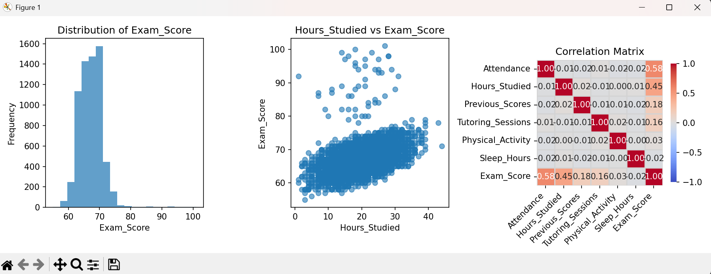

# Machine Learning - ElevvoPathways

A collection of machine learning projects and tasks for skill development and learning.

## 📊 Task 1: Student Performance Indicator

A complete machine learning project that predicts student exam scores using various performance factors.

### 🎯 Overview
- **Dataset**: Student performance factors including study hours, attendance, parental involvement, etc.
- **Goal**: Build a regression model to predict exam scores
- **Approach**: Linear regression with comprehensive feature analysis and visualization
- **Tools**: Python, pandas, scikit-learn, matplotlib, seaborn

### 📋 Requirements
```bash
pip install pandas numpy matplotlib seaborn scikit-learn jupyter
```

### 💻 Code Implementation

#### Data Loading and Preprocessing
```python
import pandas as pd
import numpy as np
import matplotlib.pyplot as plt
import seaborn as sns
from sklearn.model_selection import train_test_split
from sklearn.linear_model import LinearRegression
from sklearn.metrics import mean_squared_error, r2_score, mean_absolute_error

# Load dataset
df = pd.read_csv('data/StudentPerformanceFactors.csv')

# Data cleaning and preprocessing
for col in df.columns:
    if df[col].dtype == 'object':
        converted = pd.to_numeric(df[col], errors='ignore')
        if not converted.equals(df[col]):
            df[col] = converted

# Handle missing values
for col in df.columns:
    if pd.api.types.is_numeric_dtype(df[col]):
        df[col] = df[col].fillna(df[col].median())
    else:
        if df[col].isnull().any():
            mode_val = df[col].mode(dropna=True)
            if not mode_val.empty:
                df[col] = df[col].fillna(mode_val.iloc[0])
```

#### Exploratory Data Analysis
```python
# Target variable analysis
target = 'Exam_Score'
print(f"Score range: {df[target].min():.2f} - {df[target].max():.2f}")
print(f"Score average: {df[target].mean():.2f}")

# Correlation analysis
numeric_df = df.select_dtypes(include=[np.number])
correlation_matrix = numeric_df.corr()

# Visualization
plt.figure(figsize=(12, 4))
plt.subplot(1, 3, 1)
plt.hist(df[target], bins=20, alpha=0.7)
plt.title(f'Distribution of {target}')

plt.subplot(1, 3, 2)
plt.scatter(df['Hours_Studied'], df[target], alpha=0.6)
plt.title('Study Hours vs Exam Score')

plt.subplot(1, 3, 3)
sns.heatmap(correlation_matrix, annot=True, cmap='coolwarm', center=0)
plt.title('Correlation Matrix')
plt.tight_layout()
plt.show()
```

#### Model Training and Evaluation
```python
# Prepare features and target
X = df.select_dtypes(include=[np.number]).drop(columns=[target])
y = df[target]

# Handle categorical variables
categorical_cols = df.select_dtypes(include=['object']).columns
if len(categorical_cols) > 0:
    df_encoded = pd.get_dummies(df, columns=categorical_cols, drop_first=True)
    X = df_encoded.select_dtypes(include=[np.number]).drop(columns=[target])

# Split the data
X_train, X_test, y_train, y_test = train_test_split(X, y, test_size=0.2, random_state=42)

# Train the model
model = LinearRegression()
model.fit(X_train, y_train)

# Make predictions
y_pred = model.predict(X_test)

# Evaluate the model
r2 = r2_score(y_test, y_pred)
rmse = np.sqrt(mean_squared_error(y_test, y_pred))
mae = mean_absolute_error(y_test, y_pred)

print(f"R² Score: {r2:.4f}")
print(f"RMSE: {rmse:.4f}")
print(f"MAE: {mae:.4f}")
```

### 📈 Results & Visualizations


*Distribution analysis, correlation matrix, and key relationships*


*Model predictions vs actual values and performance metrics*

### 📊 Performance Metrics
- **R² Score**: Measures how well the model explains the variance
- **RMSE**: Root Mean Square Error for prediction accuracy  
- **MAE**: Mean Absolute Error for average prediction difference

### 🔍 Key Features Analyzed
- Study hours per week
- Attendance rate  
- Parental involvement
- Access to resources
- Extracurricular activities
- Sleep hours
- Previous scores
- Motivation level
- Internet access
- Tutoring sessions
- Family income
- Teacher quality
- School type
- Peer influence
- Physical activity
- Learning disabilities
- Parental education level
- Distance from home
- Gender

### 📝 Key Insights
1. **Study Hours**: Strong positive correlation with exam scores
2. **Attendance**: Regular attendance significantly impacts performance
3. **Parental Involvement**: Supportive parents boost student outcomes
4. **Resource Access**: Better resources lead to better performance

### 🎓 Learning Outcomes
- Data preprocessing and cleaning techniques
- Exploratory data analysis (EDA)
- Feature importance analysis
- Linear regression modeling
- Model evaluation and validation
- Data visualization best practices

---

## 🎯 Task 2: Customer Segmentation

A comprehensive clustering analysis project that segments mall customers based on income and spending patterns using K-Means and DBSCAN algorithms.

### 🎯 Overview
- **Dataset**: Mall Customers with Annual Income and Spending Score data
- **Goal**: Segment customers into distinct groups for targeted marketing
- **Approach**: K-Means clustering with optimal cluster selection using Elbow Method and Silhouette Analysis
- **Tools**: Python, pandas, scikit-learn, matplotlib, seaborn
- **Bonus**: DBSCAN clustering comparison and business insights

### 📋 Requirements
```bash
pip install pandas numpy matplotlib seaborn scikit-learn jupyter
```

### 💻 Code Implementation

#### Customer Data Loading and Preprocessing
```python
import pandas as pd
import numpy as np
import matplotlib.pyplot as plt
import seaborn as sns
from sklearn.cluster import KMeans, DBSCAN
from sklearn.preprocessing import StandardScaler
from sklearn.metrics import silhouette_score

# Load Mall Customers dataset
df = pd.read_csv('data/Mall_Customers.csv')

# Select features for clustering
income_col = 'Annual Income (k$)'
spending_col = 'Spending Score (1-100)'
X = df[[income_col, spending_col]].copy()

# Feature scaling for optimal clustering
scaler = StandardScaler()
X_scaled = scaler.fit_transform(X)
```

#### Optimal Cluster Selection
```python
# Elbow Method and Silhouette Analysis
inertias = []
silhouette_scores = []
K_range = range(2, 11)

for k in K_range:
    kmeans = KMeans(n_clusters=k, random_state=42, n_init=10)
    kmeans.fit(X_scaled)
    inertias.append(kmeans.inertia_)
    silhouette_scores.append(silhouette_score(X_scaled, kmeans.labels_))

# Find optimal k (highest silhouette score)
optimal_k = K_range[np.argmax(silhouette_scores)]
print(f"Optimal number of clusters: {optimal_k}")

# Visualization
plt.figure(figsize=(12, 4))
plt.subplot(1, 2, 1)
plt.plot(K_range, inertias, 'bo-')
plt.title('Elbow Method For Optimal k')

plt.subplot(1, 2, 2)
plt.plot(K_range, silhouette_scores, 'ro-')
plt.title('Silhouette Score For Different k')
plt.show()
```

#### K-Means Clustering and Visualization
```python
# Apply K-Means clustering
kmeans = KMeans(n_clusters=optimal_k, random_state=42, n_init=10)
cluster_labels = kmeans.fit_predict(X_scaled)

# Visualize clusters
plt.figure(figsize=(12, 5))
plt.subplot(1, 2, 1)
scatter = plt.scatter(X[income_col], X[spending_col], 
                     c=cluster_labels, cmap='viridis', alpha=0.7)
# Plot centroids
centroids = scaler.inverse_transform(kmeans.cluster_centers_)
plt.scatter(centroids[:, 0], centroids[:, 1], 
           c='red', marker='x', s=200, linewidths=3, label='Centroids')
plt.title(f'K-Means Clustering (k={optimal_k})')
plt.xlabel('Annual Income (k$)')
plt.ylabel('Spending Score (1-100)')
plt.legend()

# DBSCAN comparison
plt.subplot(1, 2, 2)
dbscan = DBSCAN(eps=0.6, min_samples=5)
dbscan_labels = dbscan.fit_predict(X_scaled)
plt.scatter(X[income_col], X[spending_col], 
           c=dbscan_labels, cmap='plasma', alpha=0.7)
plt.title('DBSCAN Clustering')
plt.show()

# Business insights
for i in range(optimal_k):
    cluster_data = X[X['Cluster'] == i]
    print(f"Cluster {i}: {len(cluster_data)} customers")
    print(f"  Avg Income: ${cluster_data[income_col].mean():.1f}k")
    print(f"  Avg Spending: {cluster_data[spending_col].mean():.1f}")
```

### 📈 Results & Visualizations

#### Data Exploration

*Customer income and spending score distributions with scatter plot*

#### Demographics Analysis

*Age and gender distribution analysis with income/spending relationships*

#### Cluster Optimization

*Elbow Method and Silhouette Analysis for optimal cluster selection*

#### Clustering Results

*K-Means clustering results with centroids and DBSCAN comparison*

#### Advanced Cluster Analysis

*Comprehensive cluster characteristics including 3D visualization, silhouette analysis, and customer value metrics*

#### Clustering Algorithm Comparison

*Comparison of different K values and clustering algorithms with performance metrics*

### 📊 Performance Metrics
- **Silhouette Score**: Measures cluster separation and cohesion (-1 to 1, higher is better)
- **Inertia**: Within-cluster sum of squared distances (lower is better for compact clusters)
- **Elbow Method**: Visual technique to find optimal number of clusters
- **Business Impact**: Customer segment identification for targeted marketing strategies

### 🔍 Key Features Analyzed
- **Annual Income (k$)**: Customer's yearly income in thousands
- **Spending Score (1-100)**: Mall-assigned score based on customer behavior and spending patterns
- **Derived Segments**: Premium, Conservative, Aspirational, and Budget-conscious customer groups

### 📝 Key Insights
1. **Premium Segment**: High income + High spending → VIP programs and luxury products
2. **Conservative Segment**: High income + Low spending → Value-focused marketing
3. **Aspirational Segment**: Low income + High spending → Payment plans and affordable luxury
4. **Budget Segment**: Low income + Low spending → Price competition and discounts

### 🎓 Learning Outcomes
- Customer segmentation using clustering
- K-Means algorithm implementation
- Optimal cluster selection techniques
- DBSCAN clustering comparison
- Business insight generation from clusters
- Marketing strategy development based on segments

---

## 🌲 Task 3: Forest Cover Type Classification

A comprehensive machine learning project that predicts forest cover types using cartographic and environmental features from the Covertype dataset using Random Forest and XGBoost algorithms.

### 🎯 Overview
- **Dataset**: Covertype Dataset from UCI Machine Learning Repository
- **Goal**: Predict 7 forest cover types using 54 cartographic and environmental features
- **Approach**: Multi-class classification with Random Forest and XGBoost models
- **Tools**: Python, pandas, scikit-learn, XGBoost, matplotlib, seaborn
- **Features**: Hyperparameter tuning, model comparison, feature importance analysis

### 📋 Requirements
```bash
pip install pandas==2.2.2 numpy==2.0.1 scikit-learn==1.5.1 matplotlib==3.9.0 seaborn==0.13.2 xgboost==2.1.1 requests==2.32.3 joblib==1.4.2 plotly==5.22.0 ucimlrepo==0.0.7
```

### 💻 Code Implementation

#### Data Loading and Preprocessing
```python
import pandas as pd
import numpy as np
import matplotlib.pyplot as plt
import seaborn as sns
from sklearn.ensemble import RandomForestClassifier
from sklearn.metrics import classification_report, confusion_matrix
from sklearn.model_selection import train_test_split, GridSearchCV
from sklearn.preprocessing import StandardScaler
import xgboost as xgb
from ucimlrepo import fetch_ucirepo

# Load Covertype dataset from UCI
covertype = fetch_ucirepo(id=31)
X = covertype.data.features
y = covertype.data.targets
df = pd.concat([X, y], axis=1)

# Preprocess data
X_train, X_test, y_train, y_test = train_test_split(X, y, test_size=0.2, random_state=42)

# Scale continuous features
scaler = StandardScaler()
continuous_features = X_train.columns[:10]  # First 10 are continuous
X_train_scaled = X_train.copy()
X_test_scaled = X_test.copy()
X_train_scaled[continuous_features] = scaler.fit_transform(X_train[continuous_features])
X_test_scaled[continuous_features] = scaler.transform(X_test[continuous_features])
```

#### Model Training and Comparison
```python
# Train Random Forest
rf_model = RandomForestClassifier(n_estimators=200, max_depth=20, random_state=42, n_jobs=-1)
rf_model.fit(X_train_scaled, y_train)
rf_pred = rf_model.predict(X_test_scaled)

# Train XGBoost
xgb_model = xgb.XGBClassifier(n_estimators=200, max_depth=6, learning_rate=0.1,
                              random_state=42, eval_metric='mlogloss')
xgb_model.fit(X_train_scaled, y_train)
xgb_pred = xgb_model.predict(X_test_scaled)

# Evaluate models
print("Random Forest Accuracy:", accuracy_score(y_test, rf_pred))
print("XGBoost Accuracy:", accuracy_score(y_test, xgb_pred))
```

#### Feature Importance Analysis
```python
# Get feature importance from Random Forest
feature_importance = pd.DataFrame({
    'feature': X_train.columns,
    'importance': rf_model.feature_importances_
}).sort_values('importance', ascending=False)

# Display top 10 most important features
print("Top 10 Most Important Features:")
for i, (_, row) in enumerate(feature_importance.head(10).iterrows(), 1):
    print(f"{i}. {row['feature']}: {row['importance']:.4f}")
```

### 📊 Dataset Information
- **Source**: UCI Machine Learning Repository (ID: 31)
- **Size**: 581,012 samples, 55 features (54 predictors + 1 target)
- **Features**: 10 continuous (elevation, aspect, slope, etc.) + 44 categorical (wilderness areas, soil types)
- **Target Classes**: 7 forest cover types
- **Auto-download**: Dataset is automatically downloaded using ucimlrepo package

### 🌲 Forest Cover Types
1. **Spruce/Fir** - Most common type
2. **Lodgepole Pine** - Second most common type
3. **Ponderosa Pine** - Medium frequency
4. **Cottonwood/Willow** - Least common type
5. **Aspen** - Medium frequency
6. **Douglas-fir** - Common type
7. **Krummholz** - Alpine/subalpine type

### 📈 Results & Visualizations

#### Class Distribution

*Distribution of the 7 forest cover types in the dataset*

#### Model Performance Comparison

*Performance comparison between Random Forest and XGBoost models*

#### Confusion Matrices

**Random Forest Confusion Matrix:**

*Multi-class confusion matrix showing Random Forest performance*

**XGBoost Confusion Matrix:**

*Multi-class confusion matrix showing XGBoost performance*

#### Feature Importance Analysis

**Random Forest Feature Importance:**

*Top 20 most important features according to Random Forest model*

**XGBoost Feature Importance:**

*Top 20 most important features according to XGBoost model*

### 📊 Performance Metrics

#### Random Forest Results
```
Random Forest Classification Report
==================================================
Accuracy: 0.8513

                   precision    recall  f1-score   support

       Spruce/Fir       0.87      0.81      0.84    190656
   Lodgepole Pine       0.83      0.92      0.87    254971
   Ponderosa Pine       0.85      0.89      0.87     32179
Cottonwood/Willow       0.86      0.69      0.76      2472
            Aspen       0.94      0.25      0.40      8544
      Douglas-fir       0.85      0.62      0.71     15630
        Krummholz       0.94      0.81      0.87     18459

         accuracy                           0.85    522911
        macro avg       0.88      0.71      0.76    522911
     weighted avg       0.85      0.85      0.85    522911
```

#### XGBoost Results
```
XGBoost Classification Report
==================================================
Accuracy: 0.8306

                   precision    recall  f1-score   support

       Spruce/Fir       0.83      0.80      0.81    190656
   Lodgepole Pine       0.83      0.87      0.85    254971
   Ponderosa Pine       0.83      0.88      0.85     32179
Cottonwood/Willow       0.83      0.75      0.79      2472
            Aspen       0.87      0.35      0.50      8544
      Douglas-fir       0.78      0.64      0.70     15630
        Krummholz       0.91      0.84      0.87     18459

         accuracy                           0.83    522911
        macro avg       0.84      0.73      0.77    522911
     weighted avg       0.83      0.83      0.83    522911
```

### 🔍 Key Features Analyzed
**Top 10 Most Important Features (Random Forest):**
1. **Elevation** (26.62%) - Most important predictor
2. **Horizontal_Distance_To_Roadways** (9.14%) - Road accessibility
3. **Horizontal_Distance_To_Fire_Points** (8.17%) - Fire proximity
4. **Horizontal_Distance_To_Hydrology** (5.01%) - Water proximity
5. **Wilderness_Area4** (4.79%) - Specific wilderness designation
6. **Vertical_Distance_To_Hydrology** (4.74%) - Vertical water distance
7. **Aspect** (4.42%) - Compass direction of slope
8. **Hillshade_Noon** (4.31%) - Solar exposure at noon
9. **Hillshade_9am** (3.96%) - Morning solar exposure
10. **Hillshade_3pm** (3.92%) - Afternoon solar exposure

### 📝 Key Insights
1. **Elevation Dominates**: Elevation is by far the most important feature (26.6% importance)
2. **Random Forest Outperforms**: Random Forest achieved 85.13% vs XGBoost's 83.06% accuracy
3. **Distance Features Matter**: Proximity to roadways, fire points, and water sources are crucial
4. **Wilderness Areas**: Specific wilderness designations significantly influence cover type
5. **Solar Exposure**: Hillshade features help determine vegetation types
6. **Class Imbalance**: Lodgepole Pine and Spruce/Fir are most common, Cottonwood/Willow is rarest

### 🎓 Learning Outcomes
- Multi-class classification with imbalanced datasets
- Tree-based ensemble methods (Random Forest, XGBoost)
- Feature importance analysis and interpretation
- Hyperparameter tuning with GridSearchCV
- Model comparison and performance evaluation
- Handling mixed data types (continuous + categorical)
- Confusion matrix analysis for multi-class problems
- Real-world dataset processing from UCI repository

---

### 🛠️ Technologies Used
- **Python 3.x**
- **pandas** - Data manipulation and analysis
- **numpy** - Numerical computing
- **matplotlib** - Data visualization
- **seaborn** - Statistical data visualization
- **scikit-learn** - Machine learning library

---

## 👨‍💻 Author

**Abdelkader**

[](https://github.com/Abdelkader7151)
[](https://www.linkedin.com/in/abdelrhman-abdelkader-6313a4291/)

---

*This project is part of the ElevvoPathways Machine Learning curriculum.*